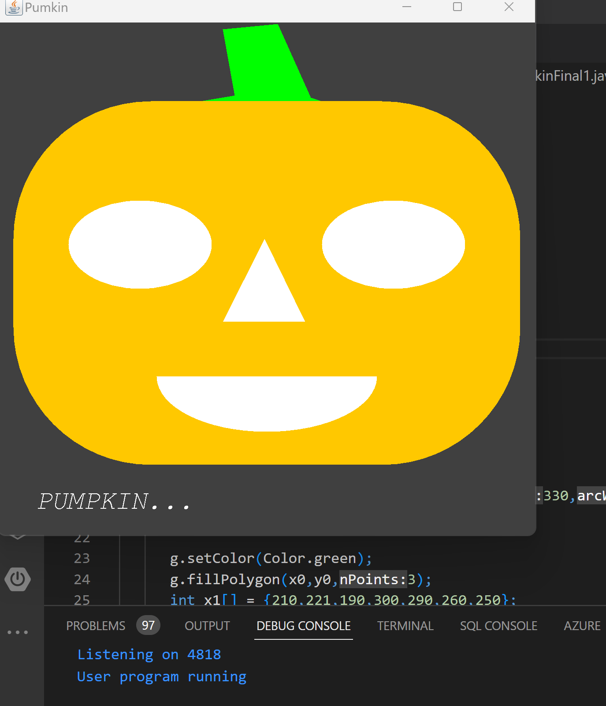

# Pumpkin

This is a simple Java program that displays a pumpkin using the `java.awt` and `javax.swing` packages the eyes and mouth change colors in a periodical way. its a smple animation done using java jframe.

## Usage

1. Compile the `Pumkin.java` file using the following command: javac PumpkinFinal1.java
2. 2. Run the program using the following command:java PumpkinFinal1

## Credits
This program was written by Adam Alemi.

